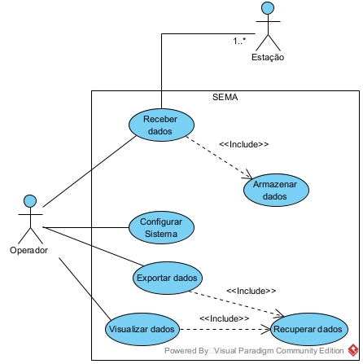

# Projeto orientado a objeto

>[!NOTE]
>O **Projeto orientado a objeto** é composto pelas documentação do projeto descrito em UML. Deve incluir um Diagrama de Classes do sistema projetado, e pelo menos um diagrama de interação de um dos casos de uso. Outros diagramas podem ser apresentados, caso julgue necessário.

O SEMA é um sistema desenvolvido em C++ que utiliza o framework QT e o protocolo de comunicação MQTT para gerenciar remotamente dados gerados por estações de monitoramento da qualidade da água.  

# Diagrama de caso de uso

# Diagrama de classes
[TODO]

# Diagrama de interação
[TODO]

#  

<strong>SUMÁRIO</strong>
  

[**1. ANÁLISE ORIENTADA A OBJETO**](sema.md) 
[**2. PROJETO ORIENTADO A OBJETO**](projeto.md) 
[**3. IMPLEMENTAÇÃO (C++)**](implementacao.md) 
[**4. TESTES**](testes.md) 

#