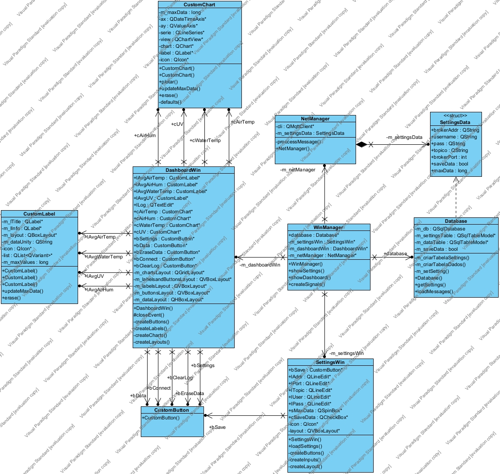

# Projeto orientado a objeto

O SEMA é um sistema desenvolvido em C++ que utiliza o framework QT e o protocolo de comunicação MQTT para gerenciar remotamente dados gerados por estações de monitoramento da qualidade da água.  

# Diagrama de caso de uso

# Diagrama de classes

#  

<strong>SUMÁRIO</strong>
  

[**1. ANÁLISE ORIENTADA A OBJETO**](sema.md) 
[**2. PROJETO ORIENTADO A OBJETO**](projeto.md) 
[**3. IMPLEMENTAÇÃO (C++)**](implementacao.md) 
[**4. TESTES**](testes.md) 

#