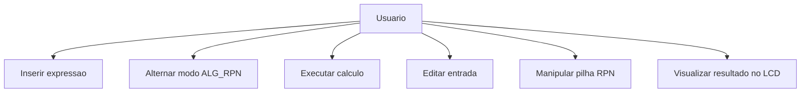
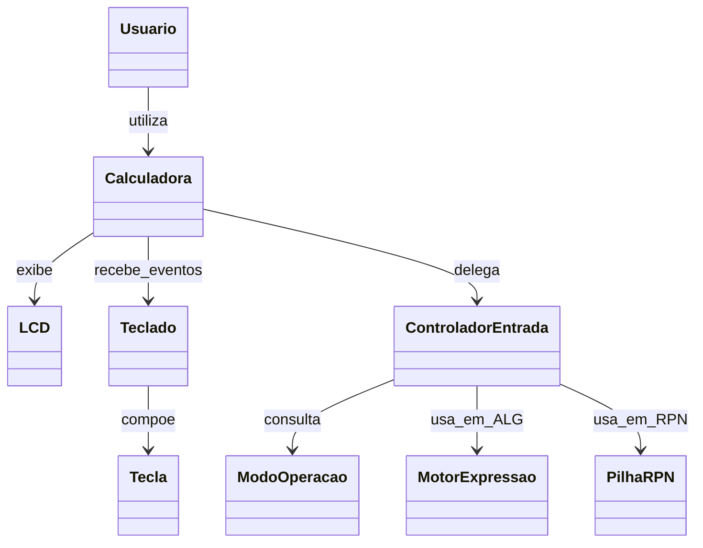

# Análise orientada a objeto
> [!NOTE]
> A **análise** orientada a objeto consiste na descrição do problema a ser tratado, duas primeiras etapas da tabela abaixo, a definição de casos de uso e a definição do domínio do problema.

## Descrição Geral do domínio do problema

O sistema proposto é uma simulação de calculadora científica/gráfica inspirada na HP 50g, com interface visual semelhante ao hardware real e funcionamento inicial compatível com o manual.

O domínio envolve três eixos principais:

- **Interação física simulada:** usuário pressiona teclas e acompanha respostas no display LCD;
- **Processamento matemático:** operações em modo ALG e modo RPN;
- **Gerência de estado:** modo ativo, conteúdo da linha de entrada, pilha RPN e histórico imediato.

### Requisitos funcionais (V1)

- RF01: Exibir tela principal com layout da HP 50g (display + teclado).
- RF02: Permitir alternar entre modos ALG e RPN.
- RF03: Em ALG, avaliar expressões com `+ - * /` e parênteses.
- RF04: Em RPN, operar pilha usando `ENTER`, `DROP`, `+`, `-`, `*`, `/`.
- RF05: Suportar edição por `BACKSPACE` e limpeza por `CLEAR`.
- RF06: Atualizar o LCD após cada ação do usuário.

### Requisitos não funcionais

- RNF01: Arquitetura orientada a objetos com separação UI/lógica.
- RNF02: Código em C++ com Qt 6 Widgets e CMake.
- RNF03: Interface com ordem e cores de teclas semelhante à referência visual.
- RNF04: Projeto didático e extensível para incluir funções futuras do manual.
- RNF05: Responsividade de interface adequada para uso em desktop.

## Rastreabilidade com o manual

- **Cap. 1:** referência para teclado, display e modos de operação.
- **Cap. 2:** referência para entrada e edição de expressões.
- **Cap. 3:** referência para cálculos reais e operações básicas.

## Diagrama de Casos de Uso

Ator principal: **Usuário (estudante)**.

 
## Diagrama de Domínio do problema

Conceitos centrais do domínio:

- **Calculadora** coordena os subsistemas.
- **Teclado/Tecla** representam o hardware de entrada.
- **LCD** representa o hardware de saída.
- **ModoOperacao** determina regras ALG ou RPN.
- **MotorExpressao/PilhaRPN** implementam comportamento matemático.

[Retroceder](README.md) | [Avançar](projeto.md)

