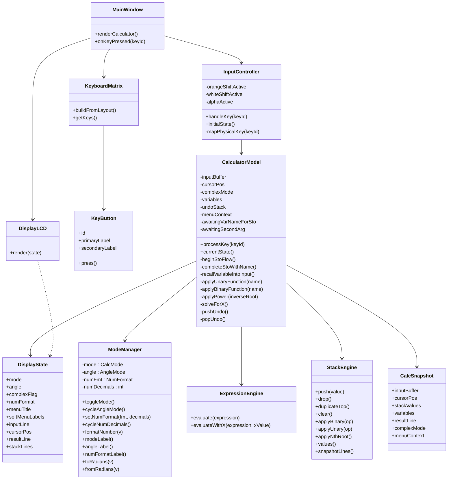
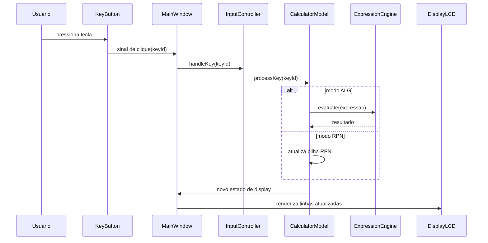

# Projeto orientado a objeto

>[!NOTE]
>O **Projeto orientado a objeto** é composto pelas documentação do projeto descrito em UML. Deve incluir um Diagrama de Classes do sistema projetado, e pelo menos um diagrama de interação de um dos casos de uso. Outros diagramas podem ser apresentados, caso julgue necessário.

## Visão arquitetural

O sistema foi projetado com separação em camadas:

- **Apresentação (Qt Widgets):** janela principal, display e botões.
- **Controle de entrada:** mapeamento de tecla para ação.
- **Domínio matemático:** execução de expressões em ALG e manipulação da pilha em RPN.
- **Estado da calculadora:** modo atual, buffer de entrada e valores da pilha.

## Diagrama de classes

## Diagrama de interação (caso de uso: executar operação)

## Rastreabilidade com o manual

- **Cap. 1:** motivou a separação `DisplayLCD`, `KeyboardMatrix` e `ModeManager`; formatos de ângulo e cabeçalho LCD.
- **Cap. 2:** motivou `InputController` e fluxo de edição de entrada, STO/RCL e UNDO (`CalcSnapshot`).
- **Cap. 3:** motivou `ExpressionEngine` para operações reais e `ModeManager::NumFormat` para FIX/SCI/ENG.
- **Cap. 5:** motivou `solveForX()` (Newton-Raphson) e `ExpressionEngine::evaluateWithX()`.
- **Cap. 17:** motivou `applyBinaryFunction()` com COMB, PERM e `applyUnaryFunction()` com FACT.

[Retroceder](analise.md) | [Avançar](implementacao.md)

